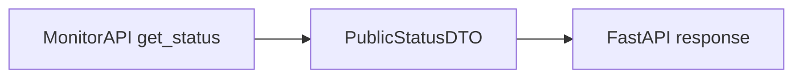

# Platform API (MonitorAPI)

Full spec: [docs/architecture/platform-abstraction.md](https://github.com/roto31/Tunnel-Monitor---Universal/blob/main/docs/architecture/platform-abstraction.md)

## Methods

| Method | CLI equivalent |
|--------|----------------|
| `run_check()` | `uvpn check` |
| `get_status()` | `uvpn status` |
| `get_statistics()` | `uvpn statistics` |
| `get_logs()` | `uvpn logs` |
| `get_diagnostics()` | `uvpn diagnostics` |
| `explain()` | `uvpn explain` |
| `preflight()` | `uvpn preflight` |
| `list_adapters()` | `uvpn adapters` |
| `full_view()` | Used by Linux GTK GUI (all tabs) |

macOS Swift GUI reads `state.json` directly for display and shells out to `uvpn` for Explain/Preflight/Adapters/Run check.

All frontends must use this API (or CLI wrappers that call it) for capability parity.

## Optional status portal (`uvpn-statusd`)

| HTTP | MonitorAPI | Notes |
|------|------------|-------|
| `GET /api/v1/status` | `get_status()` → `PublicStatusDTO` | Redacted; no `run_check` |
| `GET /api/v1/diagnostics` | `get_diagnostics()` → redacted | Bearer token required |

Install: [Status Portal](Status-Portal). Security: [Security NIST Architecture](Security-NIST-Architecture).
