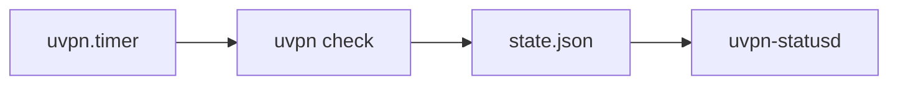

# Scheduling

Periodic `uvpn check` without manual cron.

Full guide: [docs/deploy/scheduling.md](https://github.com/roto31/Tunnel-Monitor---Universal/blob/main/docs/deploy/scheduling.md)

## Linux (systemd)

```bash
sudo bash src/deploy/linux/install-systemd.sh
```

- Timer interval: 5 minutes
- Config: `/etc/uvpn/config.json`

## macOS (LaunchAgent)

```bash
bash src/deploy/macos/install-launchagent.sh
```

- Interval: 300 seconds
- Config: `~/Library/Application Support/uvpn/config.json`
- Logs: `~/Library/Logs/uvpn-check.log`

## Minimum poll interval

Project rule: never poll faster than **30 seconds**. Default engine interval: 300s.

## Status portal (separate service)

`uvpn check` via timer writes `state.json`; **`uvpn-statusd`** only reads redacted snapshots over HTTPS on private overlay.



Install: [Status Portal](Status-Portal) · Security: [Security](Security)
