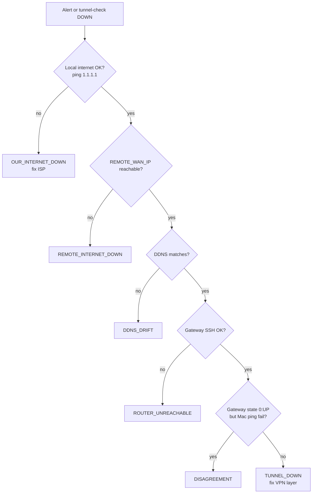

# Troubleshooting

Dual-audience guide: **quick steps** for beginners, **technical depth** for advanced operators.

Alert diagnoses appear in **email subjects** and Mac **banner titles**. Match your symptom below.

Placeholder IPs refer to [`PLACEHOLDERS.md`](../PLACEHOLDERS.md).

---

## Quick reference table

| If you see… | Likely cause | First action |
|-------------|--------------|--------------|
| `TUNNEL DOWN` / `TUNNEL_DOWN` | VPN path dead, remote WAN up | [Tunnel down](#tunnel-down) |
| `NO_PROPOSAL_CHOSEN` in charon log | Crypto mismatch after reboot | [Crypto mismatch](#no_proposal_chosen-after-remote-reboot) |
| `DDNS DRIFT` / `DDNS_DRIFT` | Hostname ≠ expected public IP | [DDNS drift](#ddns-drift) |
| `REMOTE INTERNET DOWN` | Remote site offline | Wait / contact remote site |
| `ROUTER UNREACHABLE` / `UDR7_UNREACHABLE` | Mac can't SSH local gateway | [Gateway SSH](#gateway-unreachable-mac) |
| `DISAGREEMENT` | Gateway says UP, Mac says DOWN | [Disagreement](#disagreement) |
| `OUR INTERNET DOWN` | Local ISP down | Fix local internet (no alert sent) |
| `⚠ Tunnel DOWN (heal attempted, failed)` | Ladder ran; tunnel still down | [Self-healing](#self-healing-didnt-recover-the-tunnel) |
| `⚠ Tunnel DOWN (heal exhausted)` | Consecutive heal budget spent | [Self-healing](#self-healing-didnt-recover-the-tunnel) |
| `⚠ Tunnel DOWN (heal capped — investigate root cause)` | Daily heal cap hit | [Self-healing](#self-healing-didnt-recover-the-tunnel) |
| `✓ Tunnel SELF-HEALED` | Gateway recovered without a DOWN mail | Optional; review `heal.log` |
| WAN Guard `cgnat_blocked` | Backup CGNAT WAN active | [Dual WAN](#dual-wan-and-wan-guard) |
| OpenVPN never connects | NAT/modem/key mismatch | [OpenVPN](#openvpn-wont-connect) |

---

## Tunnel down

### Beginner

1. Open UniFi **Local hub** → **VPN** → site-to-site tunnel. Note status (Connected / Offline).
2. On your Mac, run `tunnel-check`. Read the **diagnosis** line.
3. If **DDNS DRIFT** → fix DNS first ([below](#ddns-drift)).
4. If **REMOTE INTERNET DOWN** → nothing to fix locally.
5. Otherwise toggle tunnel **off/on** in UniFi. Wait 5 minutes. Run `tunnel-check` again.

### Advanced

**Gateway (local hub):**

```bash
ssh root@YOUR_ROUTER_LAN_IP
tunnel-check
journalctl -u tunnel-monitor.service -n 30
```

For **IPsec** (if still in use):

```bash
ipsec statusall
journalctl -fu strongswan -n 100
```

For **OpenVPN**:

```bash
journalctl -t openvpn -n 50
ping -c 5 REMOTE_LAN_IP
```

Look for:

- SA / tunnel **not established**
- **`Inactivity timeout (--ping-restart)`** — routing or NAT issue
- Ping OK on gateway but Mac fails → [Disagreement](#disagreement)

**Mac:**

```bash
tunnel-check
ping -c 3 REMOTE_LAN_IP
ping -c 3 REMOTE_WAN_IP
dig +short REMOTE_DDNS @1.1.1.1
tunnel-check --ssh-test
```

#### Route-Based IPsec: vti tunnel interface DOWN

Applies when `ipsec statusall` shows `0 up, 0 connecting` and the
strongSwan daemon is running, but the tunnel IP is **absent** from the
Listening IP addresses block.

**Diagnose:**

```bash
ipsec statusall | grep -A5 "Listening IP"
ip addr show | grep -E "(vti|tun)"
```

If `TUNNEL_IP` is missing from Listening IPs AND the vti interface shows
`state DOWN`, the kernel interface exists but strongSwan cannot bind to it.

**Fix:**

```bash
ip link set vti64 up        # interface name may differ — check ip addr output
ipsec reload
# Verify TUNNEL_IP now appears in Listening IPs:
ipsec statusall | grep -A5 "Listening IP"
# Then initiate:
ipsec up <conn-name>        # conn-name from ipsec statusall Connections block
```

**Root cause:** When a WAN flap, firmware reload, or manual daemon restart
triggers strongSwan to stop and start, UniFi's post-restart hook can fail to
bring the vti interface UP. The interface descriptor is re-applied by the
kernel (so the IP is visible via `ip addr`) but the link state stays DOWN.
strongSwan silently skips interfaces that are DOWN at bind time, so it never
listens on `TUNNEL_IP`.

**When `ipsec restart` doesn't work (stale PID files):**

```bash
pkill -9 charon 2>/dev/null
pkill -9 starter 2>/dev/null
sleep 2
rm -f /var/run/charon.pid /var/run/starter.charon.pid
ipsec start
sleep 5
ipsec statusall | head -15
```

> **Firmware note:** `swanctl` is not available on all UniFi gateway
> firmware. If `swanctl: command not found`, use `ipsec` equivalents
> throughout (`ipsec statusall`, `ipsec up`, `ipsec down`,
> `ipsec stroke loglevel ike 3`). The `ipsec` command is always present.

---

## Self-healing didn't recover the tunnel

Gateway-only. See [self-healing.md](self-healing.md) for the ladder and rails.

### Beginner

1. Read the **\[ Self-Healing Attempts \]** block in the alert email (which
   step skipped, failed, or was disabled).
2. If the subject says **heal capped** or **heal exhausted**, do **not** keep
   toggling the VPN hoping the monitor will fix it — follow
   [Tunnel down](#tunnel-down) as if healing were off.
3. On the gateway:

   ```bash
   ssh root@YOUR_ROUTER_LAN_IP
   tunnel-check --heal-status
   tunnel-check --heal-log
   ```

4. To stop healing immediately:

   ```bash
   sed -i 's/^HEAL_ENABLED=.*/HEAL_ENABLED="false"/' /data/tunnel-monitor/config.env
   ```

### Advanced

```bash
tunnel-check --heal-log
ipsec statusall | head -20
ip -o link show
ip -o addr show
```

Interpret the ladder:

| Log | Meaning |
|-----|---------|
| step 1 SKIPPED (already UP) | Admin-state was not the problem |
| step 1 post-check failed | Interface up but `TUNNEL_IP` still absent from Listening IPs — wait/reload |
| step 2 connection not loaded | `ipsec reload` did not register `<conn-name>` |
| step 3 FAILED (peer not responding) | Local stack tried; far end or crypto/path still broken |
| step 4 DISABLED | Expected unless `HEAL_ALLOW_DAEMON_RESTART=true` |
| skipped (local internet down) | `ping 1.1.1.1` failed — do not restart IPsec |
| skipped (OpenVPN) | Heal will not run `ipsec` on an OpenVPN deployment |

Enable **step 4** (stale-PID `pkill` + `ipsec start`) only after steps 1–3
fail while the peer is reachable and you have seen leftover `charon.pid`
files. Leave it false on a healthy tunnel.

Repeated heals (hitting the daily cap) mean the monitor is masking a root
cause: WAN flaps, UniFi post-restart hooks, or firmware. Fix that instead of
raising `HEAL_MAX_PER_DAY`.

---

## NO_PROPOSAL_CHOSEN after remote reboot

### Beginner

The remote gateway rebooted (power outage, firmware update, or manual
restart). The tunnel stays **Offline** even though both gateways are
reachable.

1. Open the remote gateway's UniFi Network app.
2. Go to **VPN → Site-to-Site → your tunnel → Edit → Advanced → Manual**.
3. Verify all crypto fields match your hub's settings exactly. See
   [implementation-guide.md](implementation-guide.md) for the reference values.
4. Tap **Apply Changes**.
5. **Re-open** the edit panel immediately and confirm the values persisted —
   UniFi silently resets crypto and Auth ID fields on Apply in some firmware
   versions. If any field reverted, fix and Apply again.
6. Wait 2 minutes. Check tunnel status.

### Advanced

**Symptoms:**

- `journalctl -f | grep charon` on the hub shows inbound `IKE_SA_INIT`
  arriving from the remote WAN IP.
- The hub responds with `N(NO_PROP)` (NO_PROPOSAL_CHOSEN).
- Both gateways' UniFi UIs claim matching crypto settings.
- Inbound `IKE_SA_INIT` payload is shorter than usual — often missing
  `N(FRAG_SUP)` or `N(HASH_ALG)` extension flags — indicating the remote
  is sending a minimal/legacy proposal set.

**Cause:** UniFi's Advanced crypto settings (Manual mode) can revert to
Auto defaults when the daemon restarts after a reboot, even though the UI
continues to display the previously saved Manual values. The stored UI config
and the running strongSwan config diverge.

**Diagnose — see the actual proposal exchange:**

```bash
# Enable verbose IKE logging (temporary — reset to 0 when done)
ipsec stroke loglevel ike 3
ipsec stroke loglevel cfg 3

# Window 1: watch the log
journalctl -f | grep charon

# Window 2: force a renegotiation
ipsec down <conn-name>
ipsec up <conn-name>
```

Look for lines like:

```
received proposals: IKE:AES_CBC_128/HMAC_SHA1_96/PRF_HMAC_SHA1/MODP_1024
configured proposals: IKE:AES_CBC_256/HMAC_SHA2_256_128/PRF_HMAC_SHA2_256/MODP_2048
no matching proposal found
```

The `received proposals` line shows exactly what the remote is offering and
which component differs.

Reset log verbosity when done:

```bash
ipsec stroke loglevel ike 0
ipsec stroke loglevel cfg 0
```

**Fix on the remote gateway (via UniFi Network app):**

1. Open tunnel → Edit → Advanced → switch to **Manual** mode
2. Confirm every field (even if it looks right — it may have reverted):
   - Key Exchange: **IKEv2**
   - IKE Encryption: **AES-256**, Hash: **SHA256**, DH Group: **14**
   - ESP Encryption: **AES-256**, Hash: **SHA256**, DH Group: **14**
   - Perfect Forward Secrecy: **✅ checked**
   - Local Authentication ID: **Auto unchecked**, value set explicitly
   - Remote Authentication ID: as configured in your deployment
3. Tap **Apply Changes**
4. Immediately re-open the edit panel. Verify all fields persisted.
   If Auth IDs or crypto fields reverted, they were not actually saved.
   Fix and Apply again until the re-opened panel confirms them.
5. Force renegotiation from the hub:
   ```bash
   ipsec down <conn-name>
   ipsec up <conn-name>
   ```

**Auth ID drift specifically:**

After any firmware update or tunnel edit, both Auth ID fields are at risk of
silent reset. The working Auth ID pattern for a spoke behind a NAT'd modem is:

| Side | Local Auth ID | Remote Auth ID |
| ---- | ------------- | -------------- |
| Spoke (behind NAT) | explicit private WAN IP (e.g. `10.x.x.x`) | Auto |
| Hub | Auto | explicit private WAN IP (same value) |

If either side reverts Local or Remote Auth ID to Auto when the other side
expects an explicit value, IKEv2 AUTH will fail silently or `NO_PROP` will
be generated before AUTH is even reached.

---

## DDNS drift

### Beginner

Your monitor compares `REMOTE_DDNS` to `REMOTE_WAN_IP`. If the hostname resolves to a **different** address, the remote ISP probably changed their public IP.

1. Get the remote site's current public IP (modem status page or whatismyip.com **at the remote site**).
2. Log into your DDNS provider. Update the **A record** for `REMOTE_DDNS`.
3. Wait ~5 minutes. Run `tunnel-check` on Mac and gateway.

### Advanced

```bash
dig +short REMOTE_DDNS @1.1.1.1
# Compare to REMOTE_WAN_IP in config.env
```

Update `REMOTE_WAN_IP` in **both** config files if you intentionally changed the expected IP.

**Local hub DDNS (WAN Guard):** If **your** hostname (what remote dials) shows a **private** address (`10.x`, `192.168.x`, `172.16–31.x`), see [Dual WAN](#dual-wan-and-wan-guard).

---

## Remote internet down

### Beginner

The remote site's modem/WAN is offline. Your equipment is fine. Wait or contact whoever manages the remote site.

### Advanced

Confirm from **both** vantage points:

```bash
ping -c 3 REMOTE_WAN_IP          # Mac
ssh root@ROUTER_LAN_IP 'ping -c 3 REMOTE_WAN_IP'
```

If both fail, diagnosis is correct.

---

## Gateway unreachable (Mac)

### Beginner

The Mac monitor cannot SSH to your **local gateway** for dedup.

1. Can you open `https://ROUTER_LAN_IP` in a browser?
2. If no → power-cycle the local gateway.
3. If yes → run `tunnel-check --ssh-test`. Follow installer SSH key steps in [mac/README.md](../mac/README.md).

### Advanced

```bash
ping -c 3 ROUTER_LAN_IP
ls -la /opt/tunnel-monitor/.ssh/
ssh -i /opt/tunnel-monitor/.ssh/id_ed25519 root@ROUTER_LAN_IP 'cat /data/tunnel-monitor/state'
```

Fix `authorized_keys`, permissions (`0600` key), or remove stale `known_hosts`.

---

## Disagreement

### Beginner

The **gateway thinks the tunnel is UP**; your **Mac cannot** reach the remote LAN.

1. Confirm the Mac is on the **main LAN**, not guest Wi‑Fi.
2. Turn Wi‑Fi off and on (or replug Ethernet).
3. Run `tunnel-check` again.

### Advanced

```bash
route -n get REMOTE_LAN_IP    # Mac — should route via local gateway
ping -c 3 ROUTER_LAN_IP
ping -c 3 REMOTE_LAN_IP
```

SSH to gateway — if gateway ping to `REMOTE_LAN_IP` works but Mac fails, suspect Mac VLAN/firewall or split routing.

---

## Dual WAN and WAN Guard

### Beginner

If your **local hub** has two internet connections and the **backup uses CGNAT** (private `192.168.x` on WAN):

- **Do not** point DDNS at the backup address.
- Install [WAN Guard](../unifi/wan-guard/) and **turn off UniFi Dynamic DNS** on both WANs.
- When primary WAN is down, the VPN may stay offline until primary returns — that protects remote clients from dialing a bad address.

Full guide: [wan-guard-openvpn-failover.md](wan-guard-openvpn-failover.md).

### Advanced

```bash
ssh root@ROUTER_LAN_IP
wan-guard status
dig +short YOUR_HUB_DDNS @1.1.1.1
ip -4 addr show WAN_GUARD_INTERFACE
```

| If | Then |
|----|------|
| `last_check_status=cgnat_blocked` | Expected during primary outage; DNS should **not** show CGNAT |
| `last_check_status=in_sync` | Primary public IP matches DNS |
| Missing `ALERT_EMAIL` error | Set `ALERT_TO` in config; use latest `wan-guard.sh` (aliases `SMTP_PASSWORD`) |

---

## OpenVPN won't connect

### Beginner

1. Confirm **same 512-char key** on both UniFi tunnels (copy/paste error is common).
2. Remote modem: set **DMZ** to UniFi WAN IP **or** forward **UDP 1194** to UniFi.
3. Try **UDP 8443** on **both** ends if 1194 fails ([migration guide](openvpn-site-to-site-migration.md)).
4. Remote tunnel **Remote hostname** must match your **DDNS**, not an old IP.

### Advanced

**Hub gateway logs:**

```bash
journalctl -t openvpn -n 100 | grep -E 'Initialization|timeout|ROUTE'
```

**Checklist:**

- [ ] Tunnel IPs unique (e.g. `10.255.0.1` / `.2`)
- [ ] Remote networks list includes peer LAN CIDR
- [ ] Hub DDNS resolves to **public** primary WAN
- [ ] No double port-forward + DMZ conflict on upstream modem

Reference: [Ubiquiti OpenVPN Site-to-Site](https://help.ui.com/hc/en-us/articles/12646699585047-UniFi-Gateway-OpenVPN-Site-to-Site).

---

## IPsec blocked by ISP modem

### Beginner

Symptoms: tunnel worked before, remote site behind **ISP modem double-NAT**, **IPsec never comes up** despite correct UniFi settings.

**Fix:** Migrate to OpenVPN — [openvpn-site-to-site-migration.md](openvpn-site-to-site-migration.md). IPsec UDP 500/4500 is blocked on some firmware revisions regardless of port forwards.

### Advanced

**Step 1 — Confirm the symptom with a wire-level capture:**

Run both commands simultaneously on the hub gateway. The capture will show
whether IKE packets are reaching the remote or being silently dropped.

```bash
# Window 1 — capture traffic to/from remote WAN
tcpdump -i any -n -nn 'host REMOTE_WAN_IP and (port 500 or port 4500 or icmp)'

# Window 2 — trigger IKE (in a second SSH session)
ipsec up <conn-name>
```

**Interpret the capture:**

| tcpdump shows | Diagnosis |
| --- | --- |
| ICMP both directions + UDP 500 **outbound only** | Modem dropping IKE silently — modem filter or Advanced Security active |
| ICMP both directions + UDP 500 **both directions** | IKE reaching remote; diagnose crypto mismatch instead (see above) |
| ICMP both directions + UDP 500 outbound + **ICMP unreachable** reply | Modem actively rejecting — port forward misconfigured or absent |
| ICMP outbound only (no replies at all) | Remote WAN entirely unreachable — not a port forward issue |

If ICMP works but UDP 500 is one-way only, the modem is performing selective
filtering at a layer above the port forward rules. Fixing port forwards will
not help; see the DMZ and Advanced Security steps below.

**Step 2 — DMZ vs port forwards:**

If the remote modem has **DMZ** configured to forward all traffic to the
UniFi WAN IP, **individual port forwards are irrelevant**. DMZ takes
precedence and forwards all unsolicited inbound traffic including UDP 500
and 4500. Do not spend time debugging port forward rules if DMZ is active.

Check the modem admin UI or ISP app for a DMZ or "Exposed Host" setting.
If DMZ is already pointing at the UniFi WAN IP, skip port forward debugging
and go directly to the Advanced Security check below.

**Step 3 — Verify port forward values if DMZ is not active:**

Port forward rules can contain silent typos from the ISP app (e.g. `550`
saved instead of `500`), and some modem firmware updates reset or corrupt
saved rules after reboot. Confirm:

- UDP **500** → UniFi WAN IP port 500
- UDP **4500** → UniFi WAN IP port 4500

Delete and recreate both entries rather than editing in place — some modem
firmware shows the corrected value in the UI but retains the old rule in
the running config until the entry is fully removed and re-added.

**Step 4 — ISP "Advanced Security" / IPsec pass-through:**

Some ISP modems (notably Comcast XB7) have an "Advanced Security" feature
that silently blocks unsolicited inbound UDP — including IKE — regardless
of port forward rules. The behavior is documented in the port forwarding UI:

> *"If Advanced Security detects a threat to a device with open ports, it
> will block all traffic to these ports until the threat is resolved."*

Locate this setting in the ISP app (often under Account → Security, or
Advanced Settings → Advanced Security) and disable it. Test immediately
after — effects are usually instantaneous, no reboot required.

If the modem has a **VPN Pass-Through** or **IPsec Pass-Through** toggle,
enable it. This bypass is distinct from Advanced Security on some firmware.

**Step 5 — If modem filtering cannot be resolved:**

Migrate to OpenVPN — see [openvpn-site-to-site-migration.md](openvpn-site-to-site-migration.md).
OpenVPN on UDP 1194 (or 8443) is not subject to ISP IPsec pass-through
filtering because it does not use IKE on port 500.

---

## Email not sending

### Beginner

Run test on each installed side:

```bash
tunnel-check --test-email          # Mac or gateway
wan-guard test-email               # WAN Guard on hub
```

Use an **app-specific password**, not your normal email password (iCloud, Google, etc.).

### Advanced

- `ALERT_FROM` must match `SMTP_USER` on iCloud.
- Port **587** STARTTLS — scripts use `curl smtp://`, not implicit SSL 465.
- Check `journalctl -u tunnel-monitor` or Mac `monitor.log` for curl errors.

---

## After UniFi firmware update

### Beginner

Re-run installers from saved source folders — `config.env`, `state`,
`heal-state`, and `heal.log` are preserved:

```bash
cd /root/tunnel-monitor-src && bash install.sh
cd /root/wan-guard-src && bash install.sh   # if used
```

### Advanced

Verify timers:

```bash
systemctl list-timers tunnel-monitor.timer wan-guard.timer
```

Re-check `WAN_GUARD_INTERFACE` — interface names (`eth0`, `eth2`, etc.) can change after firmware updates. Tunnel interface names (`vti*`, `ipsec*`) can also change; self-healing discovers the iface from `TUNNEL_IP` rather than a hardcoded name.

---

## Decision flow (combined monitors)



Dedup details: [architecture.md](architecture.md) §3.

---

## Still stuck?

### Multiple concurrent failures

Real outages frequently involve two independent failure modes active at the
same time. Fixing one and re-testing is the only reliable way to find both.

**Common compound patterns observed in deployment:**

| First failure | Second failure | Notes |
| --- | --- | --- |
| DDNS drift (spoke DDNS client pushing private WAN IP) | Auth ID drift (both sides reverted after firmware update) | Both caused by spoke behind double-NAT modem |
| vti interface DOWN on hub (WAN flap triggered bad restart) | ISP modem port forward corrupted (same event caused modem reboot) | Fix vti first; modem issue surfaces after |
| Crypto mismatch after spoke reboot | Auth ID reversion on spoke | Both caused by same UniFi Advanced panel reset bug |

**Sequencing rule:** Fix in layer order — transport before VPN:

1. **DNS** — does the DDNS hostname resolve to the correct public IP?
2. **Internet reachability** — can each side ping the other's public IP?
3. **Modem layer** — are UDP 500/4500 actually reaching the remote UniFi
   (use tcpdump to confirm bidirectional traffic, not just UI port forward
   settings)?
4. **VPN Auth IDs** — do both sides' Local/Remote Auth ID fields match the
   working pattern for your topology?
5. **Crypto** — does the IKE proposal exchange complete without
   `NO_PROPOSAL_CHOSEN`?
6. **Interface state** — is the vti/tunnel interface in `state UP` and
   present in strongSwan's Listening IP addresses?

A mismatch at step 3 makes step 5 undiagnosable — you can't see proposal
errors if packets never arrive. Complete each layer before descending.

1. Collect: `tunnel-check` (Mac + gateway), `wan-guard status` (if any), OpenVPN/IPsec logs.
2. Compare to [implementation-guide.md](implementation-guide.md) acceptance tests.
3. Review [network-overview.md](network-overview.md) — confirm your diagram matches reality.
