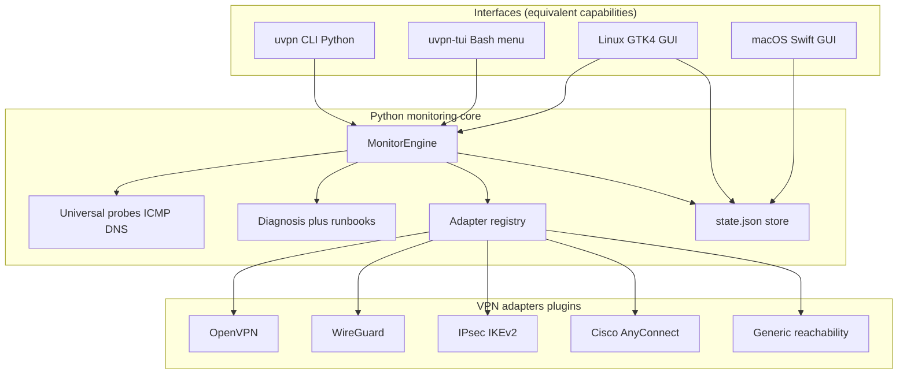
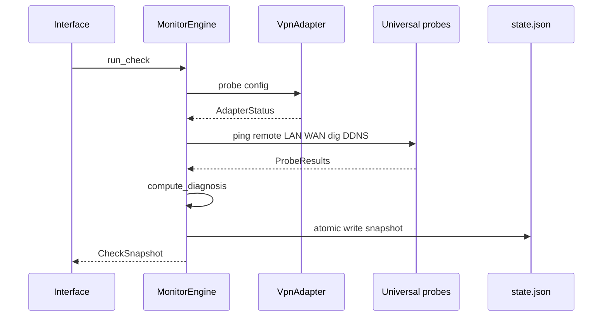
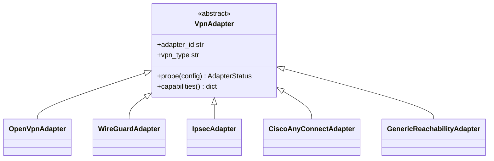

# Universal VPN Monitor — architecture

Product codename: **uvpn**. Python backend; shell CLI/TUI; native GUIs on Linux (GTK4) and macOS (Swift).

---

## 1. Layered architecture



**Rule:** GUIs never implement probes. macOS GUI reads the same `~/.config/uvpn/state.json` written by `MonitorEngine` (or invokes `uvpn check` via helper).

---

## 2. Check cycle data flow



---

## 3. Adapter plugin pattern



Register in `uvpn/adapters/registry.py`:

```python
ADAPTERS["my_vendor"] = MyVendorAdapter
```

Each adapter returns `AdapterStatus` without raising — the engine always completes a cycle.

---

## 4. Universal vs protocol-specific metrics

| Layer | Always runs | Purpose |
|-------|-------------|---------|
| **Universal probes** | Yes | End-to-end P2P health independent of vendor |
| **Adapter probe** | Per `vpn_type` | Daemon/session state (OpenVPN mgmt, `wg show`, etc.) |
| **Diagnosis** | Yes | Combines both layers |

This matches operational reality: [RFC 4271 BGP-style reachability](https://www.rfc-editor.org/rfc/rfc4271) thinking applies — **data plane** (ping) and **control plane** (VPN daemon) can diverge.

---

## 5. System requirements

### Linux (server or desktop)

| Requirement | Version |
|-------------|---------|
| Python | 3.11+ |
| ping, dig | iputils, bind-utils |
| Optional GUI | GTK 4, PyGObject 3.42+ (Ubuntu 22.04+, Fedora 38+, Debian 12+) |
| WireGuard adapter | `wireguard-tools` |
| IPsec adapter | `strongswan-swanctl` or `strongswan-starter` |
| OpenVPN adapter | OpenVPN with `--management` enabled |
| Cisco adapter | Cisco Secure Client installed |

### macOS (desktop client)

| Requirement | Version |
|-------------|---------|
| Python | 3.11+ (system or Homebrew) |
| macOS | 14+ (GUI); 26+ for Liquid Glass styling |
| Cisco adapter | Secure Client / AnyConnect binary |

---

## 6. Repository layout

```
universal-vpn-monitor/
  uvpn/                 # Python package (engine + adapters + CLI)
  scripts/              # uvpn, uvpn-tui shell entrypoints
  apps/linux/           # GTK GUI
  apps/macos/           # Swift GUI
  docs/                 # architecture, research, platform guides
  tests/
  wiki/                 # GitHub wiki source
```

Legacy bash monitor lives at repo root (`Public/`, `vendor/core/`) — **deprecated path** for Universal product goals.

---

## 7. Extensibility roadmap

| Phase | Deliverable |
|-------|-------------|
| v0.1 (now) | Core engine, 4 adapters, CLI/TUI, GTK scaffold, Swift reader |
| v0.2 | Fortinet FortiClient CLI adapter, Palo Alto GlobalProtect `gpctl` research |
| v0.3 | Pulse Secure / Ivanti CLI where documented |
| v1.0 | Signed packages, scheduler integration (systemd/launchd) |

Each new adapter requires **cited** vendor CLI/API documentation in `docs/research/`.
